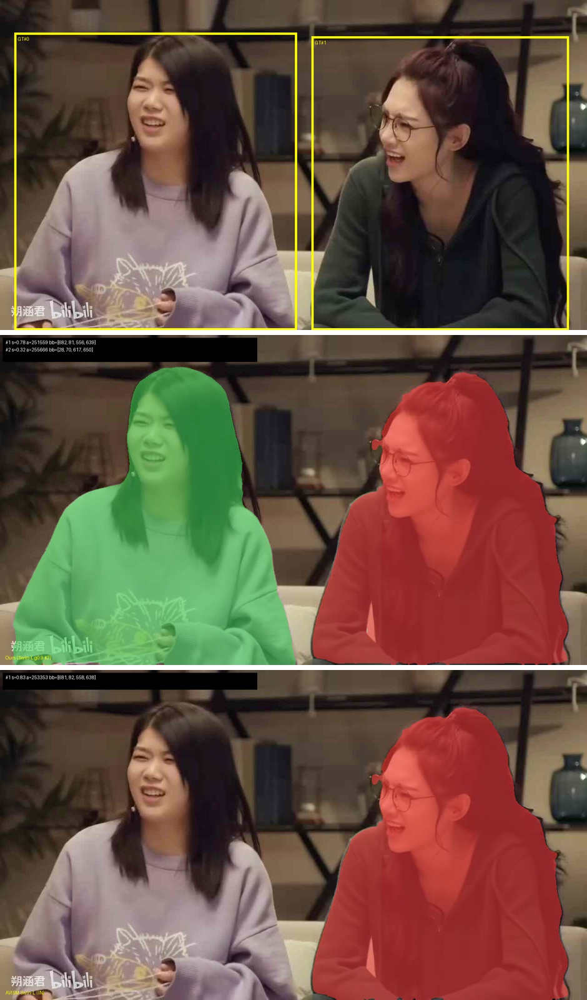
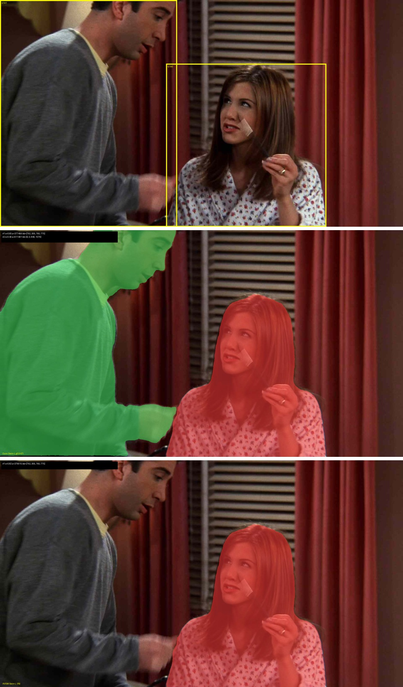
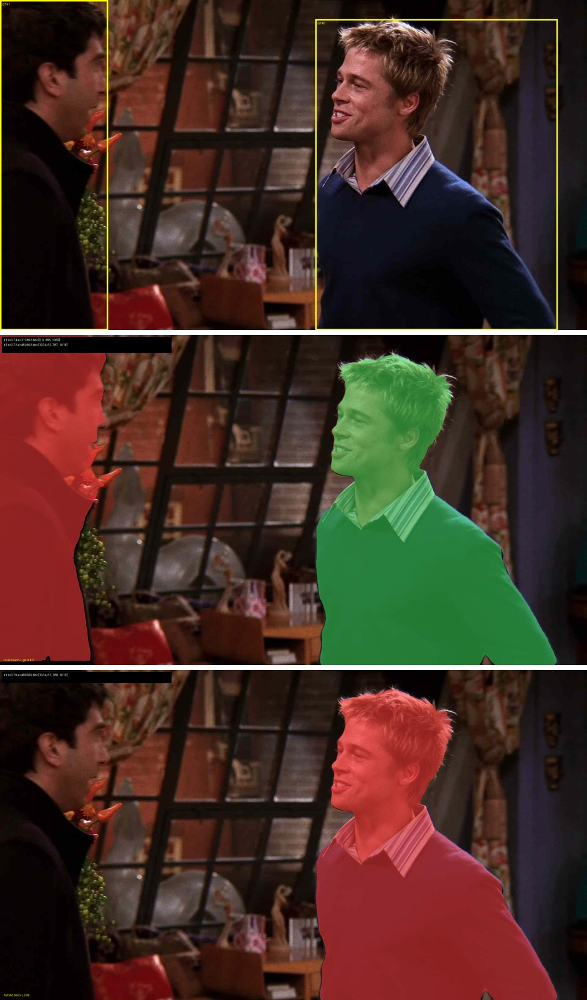

# Voiceprint-Guided-AVIS

Audio-visual instance segmentation (AVIS) targets detecting, segmenting and tracking sounding objects in videos. Existing models obtain decent results on standard benchmarks, but degrade noticeably when generalized to zero-shot complex human-centered scenarios, suffering from inconsistent instance association across frames and missed detections for small or occluded targets. Our framework anchors audio-visual correspondence to voiceprint identity: audio slots are aligned with voiceprint anchors through contrastive matching, producing frame-consistent instance representations that stabilize association across frames. We further inject spatial and appearance context from neighboring frames as attention priors, sharpening perception of occluded or small instances. On the AVTrack benchmark, our approach surpasses the AVISM R50 baseline by 2.48 HOTA, with consistent gains in both detection and association that are most pronounced for small or occluded sounding objects. Ablation studies confirm that the two proposed components are complementary.

Upon acceptance, the code and models will be released at https://github.com/wenhuiwei/Voiceprint-Guided-AVIS

## effect display
In the image below, each group, from top to bottom, shows the original image from the AVTrack dataset, the segmentation result of our model, and the segmentation result of AVISM.

