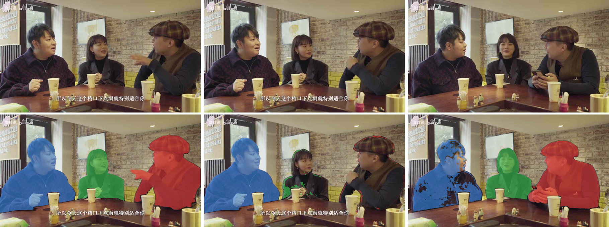
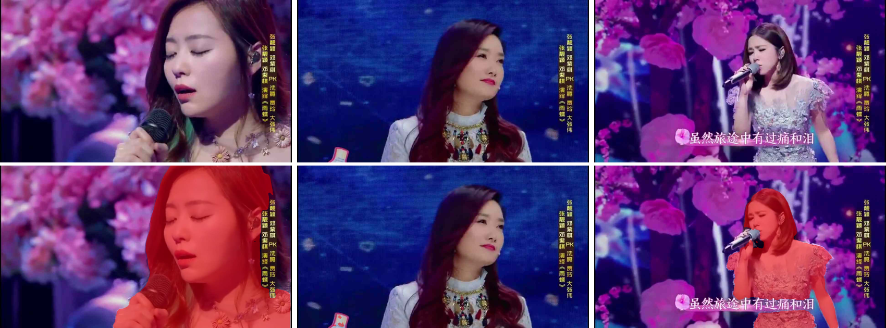

# Voiceprint-Guided-AVIS

Identifying and tracking sound-producing objects in videos is essential for scene understanding, yet remains challenging when objects are occluded or visually ambiguous. Audio-visual instance segmentation targets detecting, segmenting and tracking sounding objects in videos. Existing models obtain decent results on standard benchmarks, but degrade noticeably when generalized to zero-shot complex human-centered scenarios, suffering from inconsistent instance association across frames and missed detections for small or occluded targets. To address these issues, we develop a unified framework that establishes voiceprint-based correspondences between audio and visual instances with contrastive matching to stabilize identity across frames. Building on this, we further exploit spatial and appearance context from neighboring frames as priors to guide visual attention, improving hard instance perception. On the AVTrack benchmark, our approach surpasses the AVISM R50 baseline by 2.11 HOTA.

Upon acceptance, the code and models will be released at https://github.com/wenhuiwei/Voiceprint-Guided-AVIS

## 效果展示

